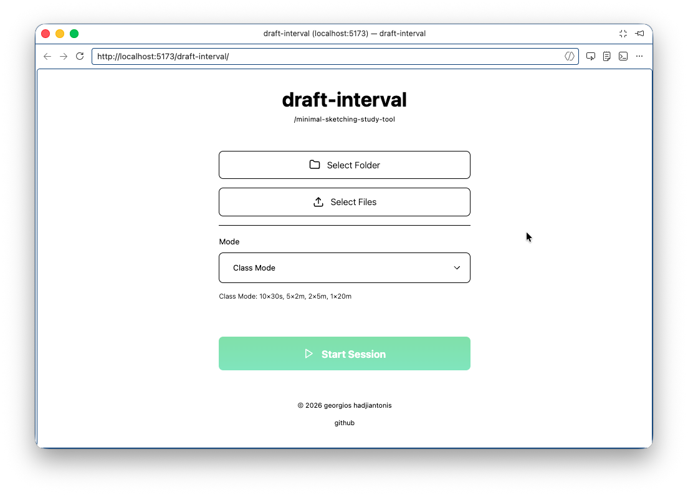
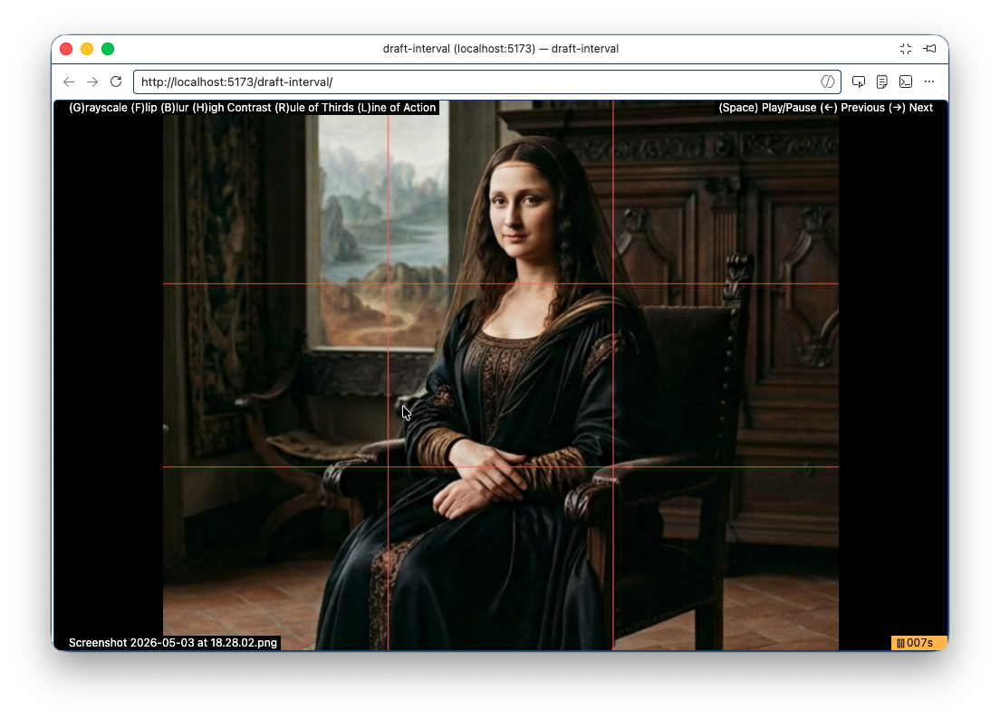

# draft-interval

A minimal gesture study tool for artists. Load local images, set a timer, and practice drawing with full-screen focus.

## Try It Now

The app is available online: 

[https://ghadj.github.io/draft-interval/](https://ghadj.github.io/draft-interval/)

## Features

- Load images from local folders (recursively scanned)
- Anti-drift countdown timer with 3 modes (fixed, class sequence, memory)
- Real-time filters (grayscale, flip, blur, high contrast)
- Rule of Thirds & Line of Action overlays
- Full keyboard control for hands-free practice

## Screenshots

## Keyboard Shortcuts

| Key | Action |
|-----|--------|
| `Space` | Play/Pause |
| `←` / `→` | Previous/Next Image |
| `G` | Toggle Grayscale |
| `F` | Toggle Flip |
| `B` | Toggle Blur |
| `H` | Toggle High Contrast |
| `R` | Toggle Rule of Thirds |
| `L` | Toggle Line of Action |
| `Esc` | Exit Practice (back to Dashboard) |

## License

MIT – See [LICENSE](LICENSE) for details.